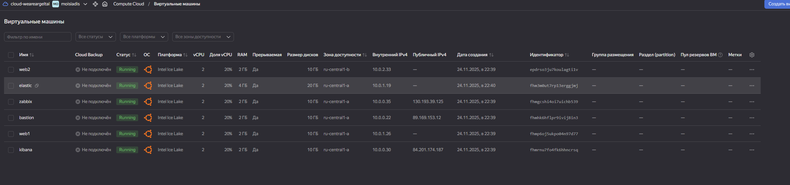
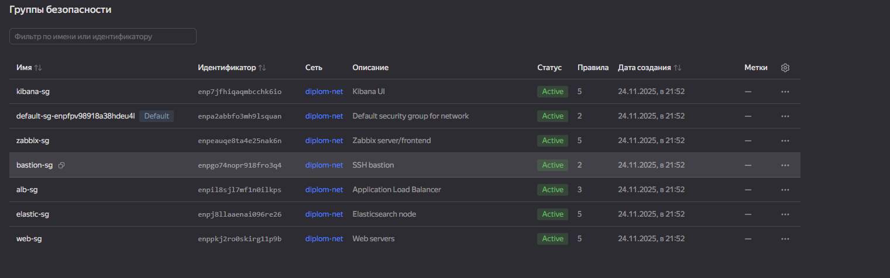
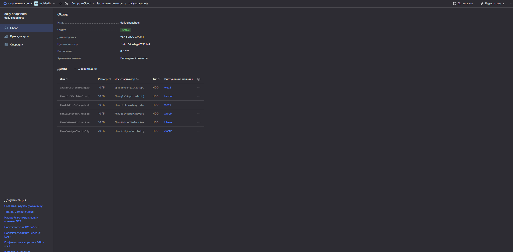
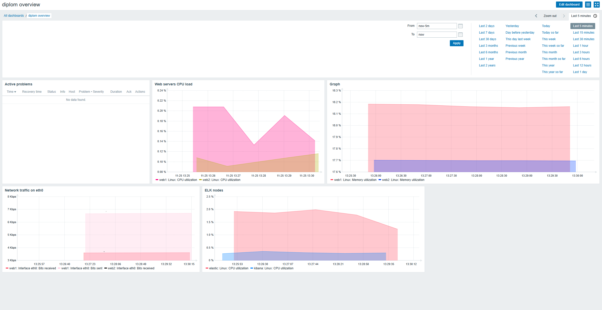
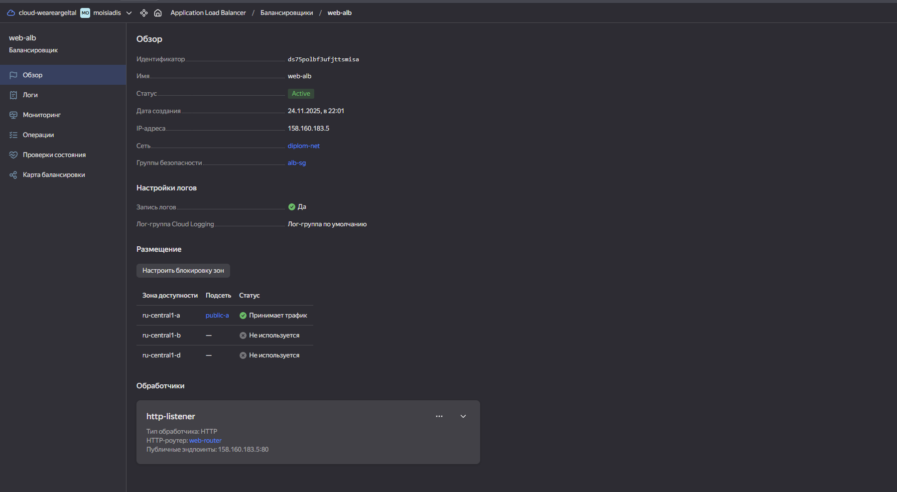
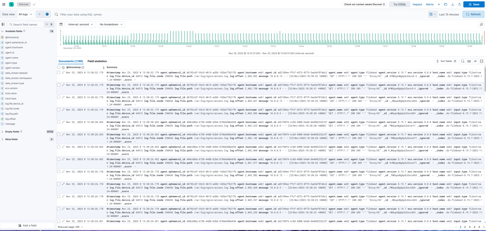
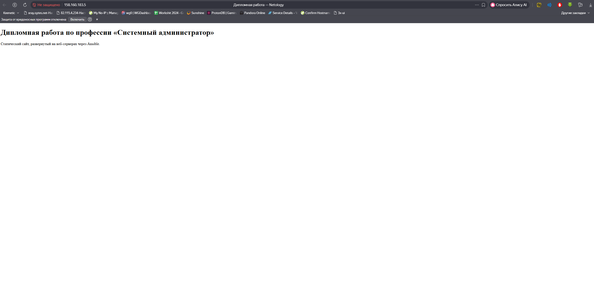

#  Дипломная работа по профессии «Системный администратор» SYS-41 Моисиадис Константин  

## Задача
Ключевая задача — разработать отказоустойчивую инфраструктуру для сайта, включающую мониторинг, сбор логов и резервное копирование основных данных. Инфраструктура должна размещаться в [Yandex Cloud](https://cloud.yandex.com/) и отвечать минимальным стандартам безопасности: запрещается выкладывать токен от облака в git. Используйте [инструкцию](https://cloud.yandex.ru/docs/tutorials/infrastructure-management/terraform-quickstart#get-credentials).  

[Полное задание к дипломной работе:](https://github.com/netology-code/sys-diplom/tree/diplom-zabbix)

# [Сайт](http://158.160.183.5)
## [Zabbix](http://130.193.39.125/zabbix/) (Логин: Admin | Пароль: zabbix)
## [Elasticsearch/Kibana](http://84.201.174.187:5601)

---

## 1. Описание дипломной работы

В рамках дипломного проекта развернута инфраструктура в Yandex Cloud:

- VPC с публичными и приватными подсетями
- ВМ: `bastion`, `zabbix`, `elastic`, `kibana`, `web1`, `web2`
- Настроенный мониторинг всех серверов в Zabbix
- ELK-логирование: Filebeat → Elasticsearch → Kibana
- Бастион для доступа к приватным ВМ по SSH
- Автоматизация развёртывания с помощью **Terraform** и **Ansible**

---

## 2. Используемые технологии

- **Terraform** — создание инфраструктуры в Yandex Cloud  
- **Ansible** — конфигурация всех ВМ  
- **Nginx** — веб-серверы `web1` и `web2`  
- **Zabbix 6.0 LTS** — система мониторинга  
- **Elasticsearch 8.x + Kibana 8.x** — сбор и визуализация логов  
- **Filebeat 8.x** — агент доставки логов nginx в Elasticsearch  

---

## 3. Результат выполнения

Инфраструктура поднимается командой: terraform apply

Конфигурация ВМ выполняется командой: ansible-playbook site.yml

Все серверы (zabbix, elastic, kibana, web1, web2) доступны и находятся под мониторингом Zabbix

Логи nginx с web1 и web2 собираются Filebeat и доступны в Kibana (индекс filebeat-*)

Веб-приложение доступно по публичному адресу балансировщика

